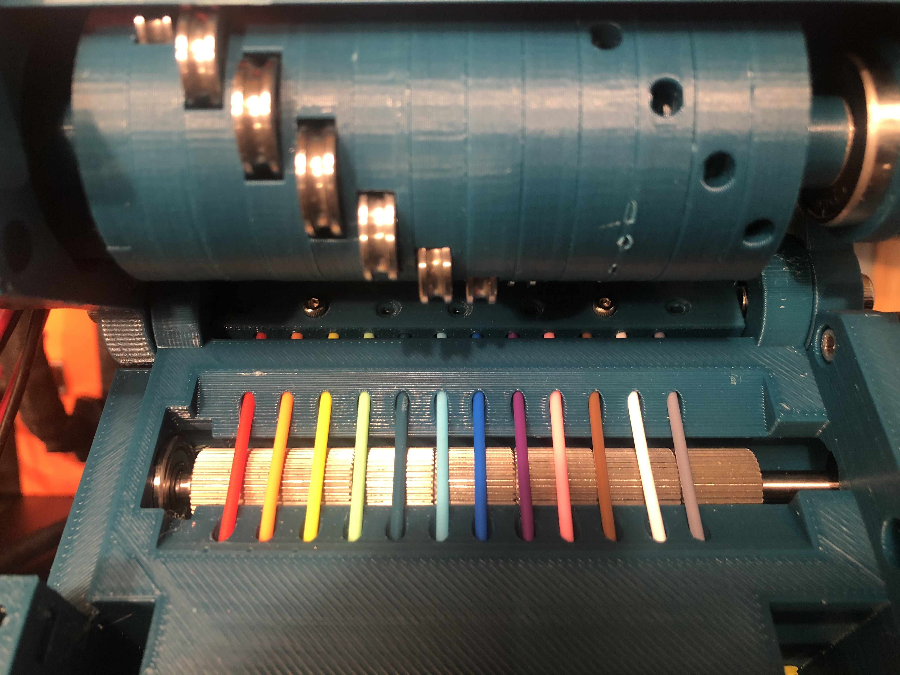
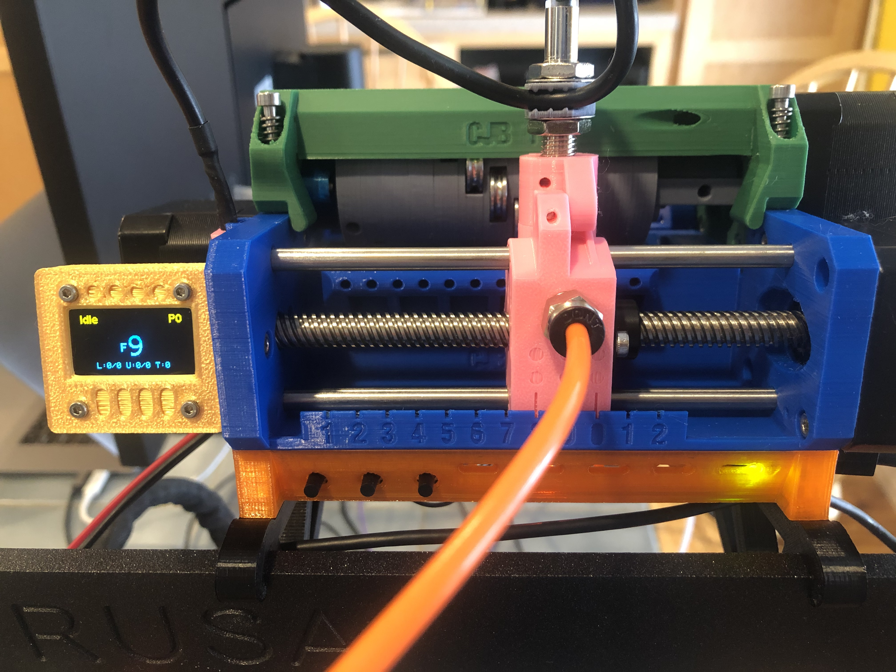
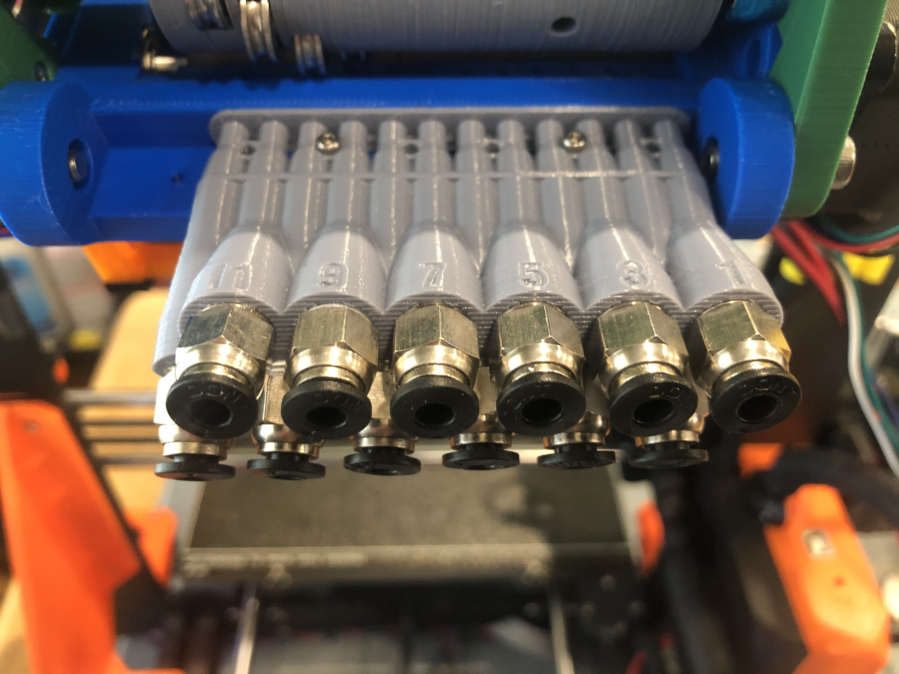
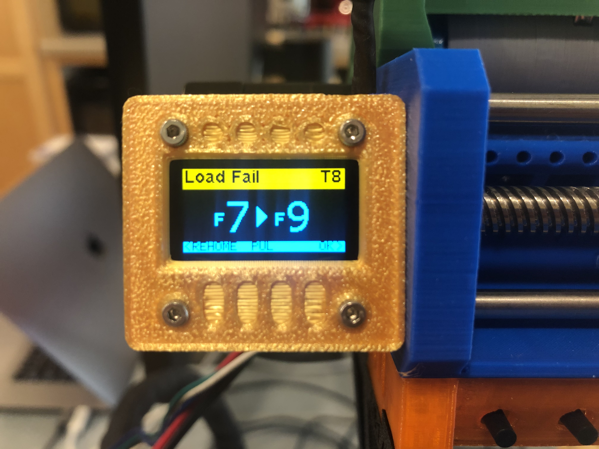
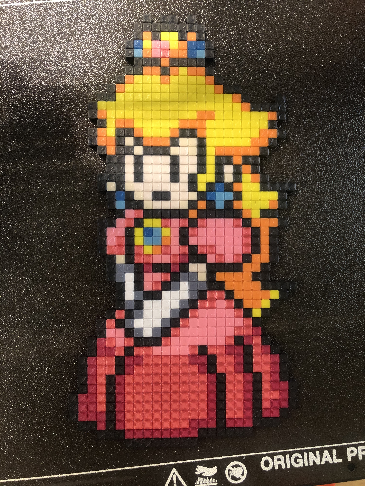

# Prusa MMU2S Modification for 12 Filaments

## Overview
This is the result of several months of designing and testing new ideas for increasing the filament count of the Prusa MMU2S. I tried several variations, but ended up coming back to something that is largely based on the original Prusa model. Some of the major adjustments include:
* increased filament count from 5 to 12
* reversed position of pulley and idler motors, to maximize the use of the 110mm pulley shaft
* moved FINDA to the rear of the selector, in an attempt to minimize issues where the filament clears the ball but then still fails to fully retract
* selector has integrated threads for PTFE quick-connect
* moved control board beneath the body (inspiration thanks to [univeraljoint](https://www.thingiverse.com/universaljoint/about))
* additional bracket mounting options
* optional integrated OLED display for more detailed state information and enhanced error recovery
* selector does not include the cutter

## The Disclaimer
These items and related code are provided as-is, with no warranty -- express or implied -- and I cannot personally guarantee that it will function and/or not break your printer. Nothing here, of course, is officially endorsed or supported by Prusa.

That being said, I have had a great deal of luck using this model, or I wouldn't be sharing it.

## Software & Firmware
In order to use this model of the MMU, you will need to use the following modified firmware for the MMU board. This has been branched from version 1.0.6, but has numerous significant changes, so whether or not I will keep this up-to-date with future version is questionable.

https://github.com/cjbaar/MM-control-01

In addition, you will need to change the firmware on the printer itself, because the existing code will ignore any tool changes above T4. This is branched from version 3.9.0-RC1. I have submitted a pull request to correct this in the base, but it is unlikely to be merged anytime soon. However, these overal modifications are much smaller, and could be re-integrated in future releases with minor effort.

https://github.com/cjbaar/Prusa-Firmware

Finally, in order to create the gcode files, you will need to create a new printer model in a MMU-aware slicer that is setup for 12 filaments. I had no issues doing this in PrusaSlicer version 2.1.0+.

## Hardware
### Printed Parts
Print one of each included STL file, with the following exceptions:
* choose either m6 or m10 thread for selector
* choose bracket type (traditional frame mount or table-top)
* print four copies of idler-rings.stl
* screen is optional, if using OLED display
* wrench is optional, but assists with assembling the inlet manifold

I printed all parts with relatively slow speed and 0.2mm layers. I also printed most everything with PLA -- in particular, the selector and idler rings -- because I get better consistency and tolerances for bearings and general fit. In my experience, printing the same model in PETG may make some pieces harder to fit together.

For the lower and selector prints, there are related mod files, which I recommended printing with 100% infill.

### Additional Parts
The following pieces are required for assembly. Items in italics may not be included in the original Prusa MMU2, but should be easily found on Amazon (or your world domination retailer of choice).
#### Lower
* (1x) Prusa MMU "Extruder" motor (std d-shaft)
* (1x) Prusa MMU "Pulley" motor (110mm d-shaft)
* (1x) Prusa MMU "Selector" motor (120mmx8mm lead screw)
* (12x) m3x10mm screw
* (6x) m3 square nut
* (4x) 625Z bearing
* (2x) 5mmx120mm steel rod
* *(7x) 12mmx12mmx5mm drive gear (40T)*

#### Upper
* (4x) m3x10mm screw
* *(2x) m3x12mm screw*
* *(2x) m5x16mm screw*
* (2x) m3x30mm screw
* (2x) m5x15mm spring

#### Idler
* *(6x) m3x20mm screw*
* *(2x) m3x25mm screw*
* (10x) m3 hex nut
* *(1x) 608RS bearing*
* *(12x) 4x13x4mm u-shaped bearing*
* *(1x) 5mmx100mm steel rod*
* *(2x) 11mmx11mmx5mm Mk8 brass drive gear (26T)*

#### Microcontoller Unit (MCU)
* *(4x) m3x14mm screw*
* *(3X) m3x12mm screw*
* (3x) m3 hex nut

#### Inlet
* *(6x) m2x16mm screw*
* *(6x) m2 hex nut*
* *(12x) m10 PTFE quick-fit connector*

#### Selector
* *(1x) m3x8mm screw*
* *(2x) m3x16mm screw*
* (1x) m3 square nut
* (2x) m3 hex nut
* (1x) T8 plastic lead screw nut
* *(1x) m10 OR m6 PTFE quick-fit connector*
* (2x) 5mm brass sleeve, cut to 20mm length

#### Brackets
* *(2x) m3x8mm screw*

#### Display (optional)
* *(1x) OLED SSD1306 display, I2C, 128x64*
* *(4x) m2x8mm screw*
* *(1x) m3x8mm screw*
* (1x) m3 square nut
* *(4x) 200mm F/F jumper wires*

## Images

## Output
A successful 12-color print

