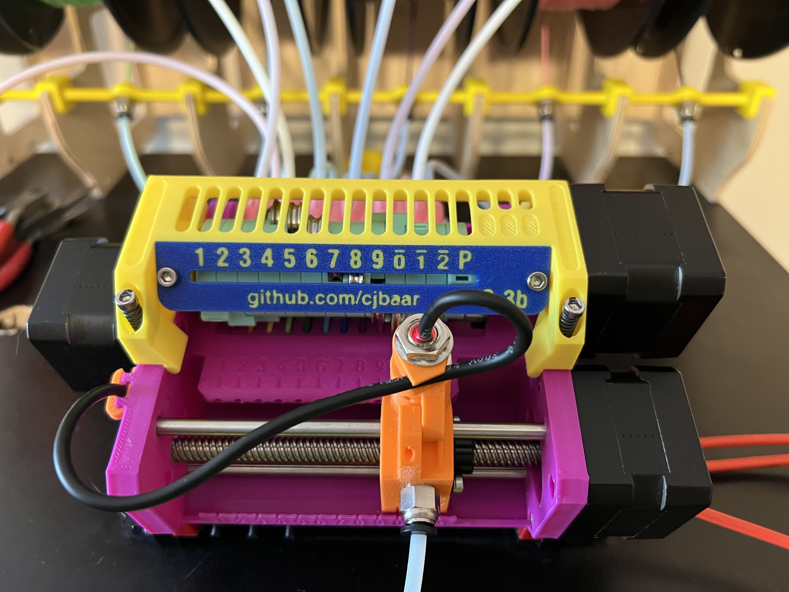
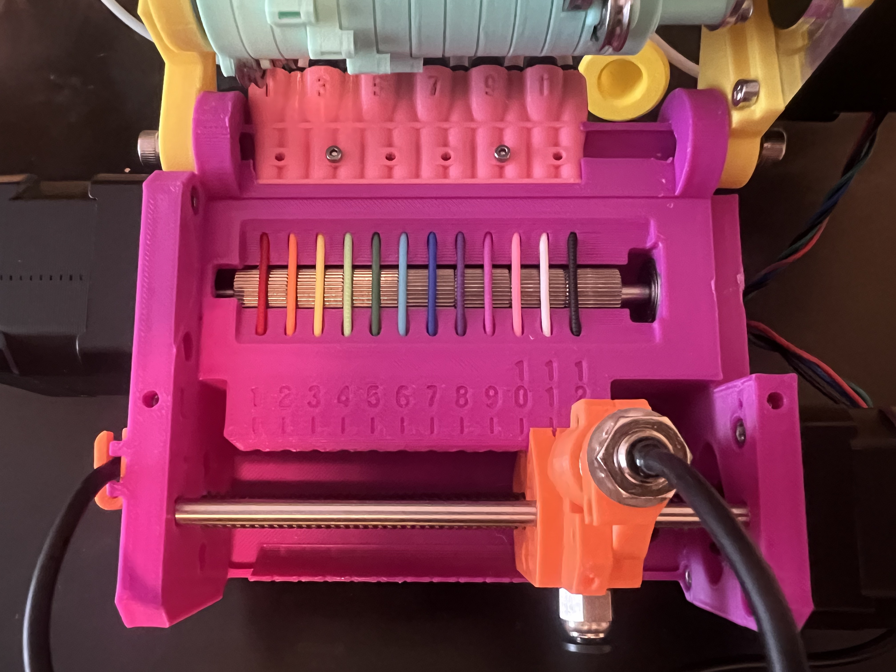
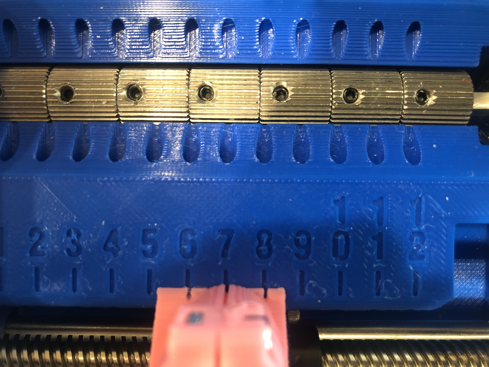
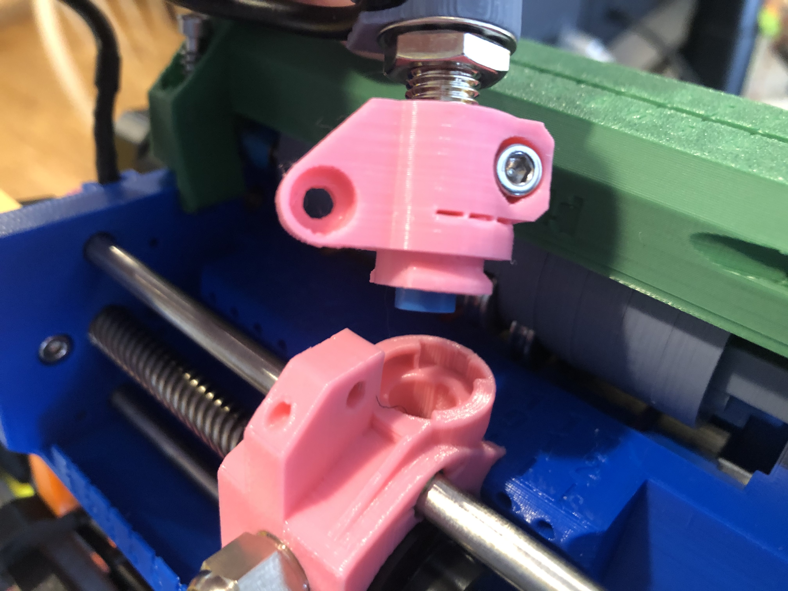
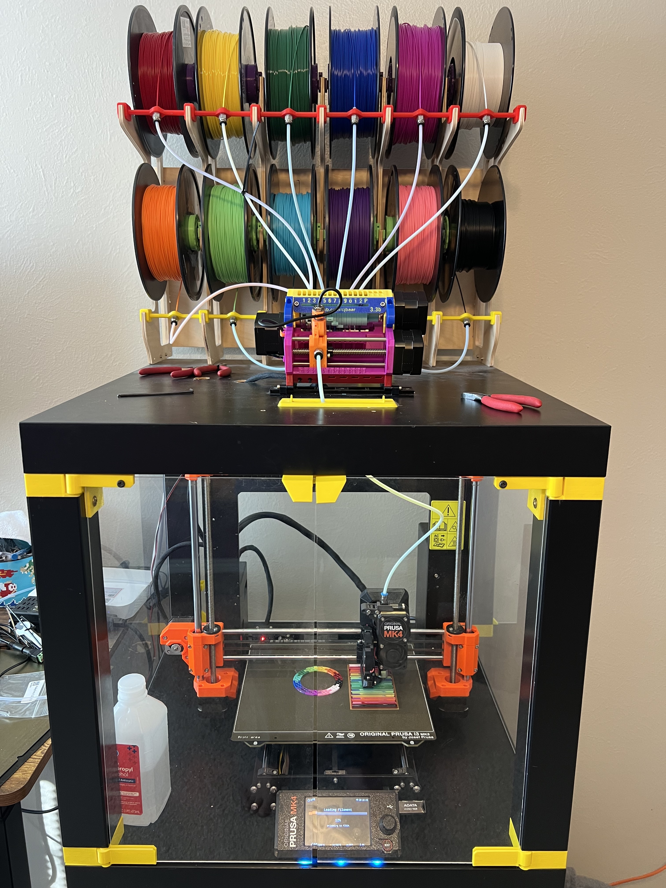

# Prusa MMU2/MMU3 Modification for 12 Filaments

## Overview

This is the result of several months of designing and testing new ideas for increasing the filament count of the Prusa MMU2S. (And then more testing and re-designs for the MMU3.)
I tried several variations, but ended up coming back to something that is largely based
on the original Prusa model. Some of the major adjustments include:
* increased filament count from 5 to 12
* reversed position of pulley and idler motors, to maximize the use of the 110mm pulley shaft
* moved FINDA to the rear of the selector, in an attempt to minimize issues where the filament clears the ball but then still fails to fully retract
* quick-release insert for FINDA sensor, for ability to clean or check ball chamber without re-calibration of FINDA height
* selector has integrated threads for PTFE quick-connect
* moved control board beneath the body (inspiration thanks to [univeraljoint](https://www.thingiverse.com/universaljoint/about))
* additional bracket mounting options
* selector does not include the cutter

As of October 2024, this project has been updated to include the MMU3 with the Mk4.
New features now also include:
* a new idler alignment gauge of the front side of the upper frame
* a streamlined idler design
* a smaller inlet that uses the PTFE collets instead of M10 screw connectors
* a cover panel for the power connection board

## The Disclaimer

*These items and related code are provided as-is, with no warranty -- express or implied -- and I cannot personally guarantee that it will function and/or not break your printer. Nothing here, of course, is officially endorsed or supported by Prusa.*

*(That being said, I -- and others -- have had a great deal of luck using this model, or I wouldn't be sharing it.)*

## Software & Firmware

### The Good News

Prusa has completely re-written the firmware for the MMU3. It is incredibly
clean and organized, and makes wonderful and proper use of configuration variables.
*(Thank you Prusa!)*
We no longer need to use custom firmware anymore, for either the MMU board
or the printer itself!

You can use the [`config.h`](./firmware/config-mmu3-mk4-12x.h) file provided here, and do your
own build with the [Prusa MMU Firmware](https://github.com/prusa3d/Prusa-Firmware-MMU) repo. would generally encourage you to become familiar with the build process if you want to proceed
with this project. I will not be compiling this into every new version that Prusa release.
However, you can download a compiled version of the current (as of now)
3.0.3 firmware [here](./firmware/cjb_fw_mk4_mmu3_3.0.3-x12.hex).

NOTE: This version of the MMU3-12x will function exactly like the
stock Prusa MMU3, as it is entirely their firmware with a few different distance
numbers. It will use the new communication protocols, and report error messages
back to the printer screen. I personally found my interface "tweaks" easier to use and
understand, but this keeps things simpler. With the amount of work Prusa has to the
stock code, it just doesn't make sense to try re-writing it anymore.

### The Bad News

With a new MMU3 kit, I had no issues compiling and uploading the firmware, using my custom
`config.h` file. However, I was not able to make this work with my existing (MMU2S) board.
The boards are more-or-less identical, and I don't think it is a hardware issue.

I can flash
the firmware and it starts up, but the printer does not receive communication from it. There
are notes in the config hinting at issues with EEPROM when changing the number of filaments.
I have also tried erasing the EEPROM, as indicated, but it still won't function.

If anyone else has better luck re-using an old board, please let me know. Otherwise, for now,
it looks like you will (unfortunately?) need to purchase an actual MMU3 kit -- or at least
the control board -- in order to make this work.

### The Potential (Unknown) News

At the moment, flashing the MMU firmware is a relatively simple process, and the current
printer firmware does not block filaments above slot 5 -- even though it does not
understand how to process or access them from the menu functions.

As of now (Oct 2024), Prusa is currently working toward a firmware model wherein
the printer will retain a 
copy of the MMU firmware, and be responsible for updating it as necessary. I have no
idea how those changes will affect the ability to side-load custom firmware onto
the MMU directly. If we have to get into changing the printer firmware itself, things
become more complicated. We will have to wait and see for now.

## Hardware

### Printed Parts
Print one of each included STL file, with the following exceptions:
* choose either m6 or m10 thread for selector base
	* or original m5 heat-set remix, thanks to [obe](./remixes/obe)
* choose bracket type (traditional frame mount or table-top)
* print four copies of idler-rings.stl

I printed all parts with on a Prusa Mk4 using the "Structural" input-shaping profile.
All are printed with 0.2mm layers and 20% infill.

I also print everything with PLA, because I get better consistency and tolerances for bearings and general fit. In my experience, printing the same model in PETG (or other material) may make some pieces harder to fit together.

For the "lower" model, there is a related mod file, which I recommended printing with 100% infill. The selector cap might also need to be 100% infill.

### Additional Parts

The following pieces are required for assembly. Items in italics may not be included in the original Prusa MMU3, but should be easily found on Amazon (or your world-domination retailer of choice).

#### Lower
* (1x) Prusa MMU "Pulley" motor (110mm d-shaft)
* (1x) Prusa MMU "Selector" motor (120mmx8mm lead screw)
* (12x) m3x10mm screw
* (6x) m3 square nut
* (4x) 625Z bearing
* (2x) 5mmx120mm steel rod
* *(7x) 12mmx12mmx5mm drive gear (40T)*\
	NOTE: I have a hard time finding actual 12mm wide gears now. All the ones I have purchased lately on Amazon claim to be 12mm, but are actually only 11mm. I have not tested if these will cause issues with the filament alignment.

#### Upper
* (1x) Prusa MMU "Idler" motor (std d-shaft)
* (3x) m3x10mm screw
* *(2x) m5x16mm screw*
* (2x) m3x30mm screw
* (2X) m3x6mm screw
* (2x) m3x15mm spring
* (2x) m3 square nut

#### Idler
* *(12x) m3x20mm screw*
* (12x) m3 hex nut
* *(1x) 608RS bearing*
* *(12x) 4x13x4mm u-shaped bearing*
* *(1x) 5mmx100mm steel rod*

#### Microcontoller Unit (MCU)
* *(4x) m3x14mm screw*
* *(3X) m3x12mm screw*
* (1X) m3x6mm screw
* (3x) m3 hex nut
* (1x) m3 square nut

#### Inlet
* *(2x-6x) m2x16mm screw*
* *(2x-6x) m2 hex nut*
* (12x) PTFE collet

#### Selector
* *(2x) m3x8mm screw*
* *(2x) m3x16mm screw*
* (2x) m3 square nut
* (2x) m3 hex nut
* (1x) T8 plastic lead screw nut
* *(1x) m10 OR m6 PTFE quick-fit connector*
* (2x) 5mm brass sleeve, cut to 20mm length
* (1x) FINDA sensor

#### Brackets
* *(2x) m3x8mm screw*

## Images

## Testing
Full setup with spool rewinders from [VincentGroenhuis](https://www.thingiverse.com/thing:3781815/files)

## Output
A successful 12-color print. 440 total tool changes .... 

