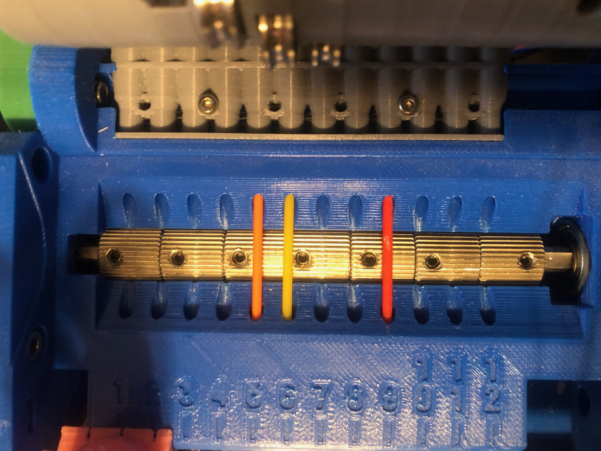
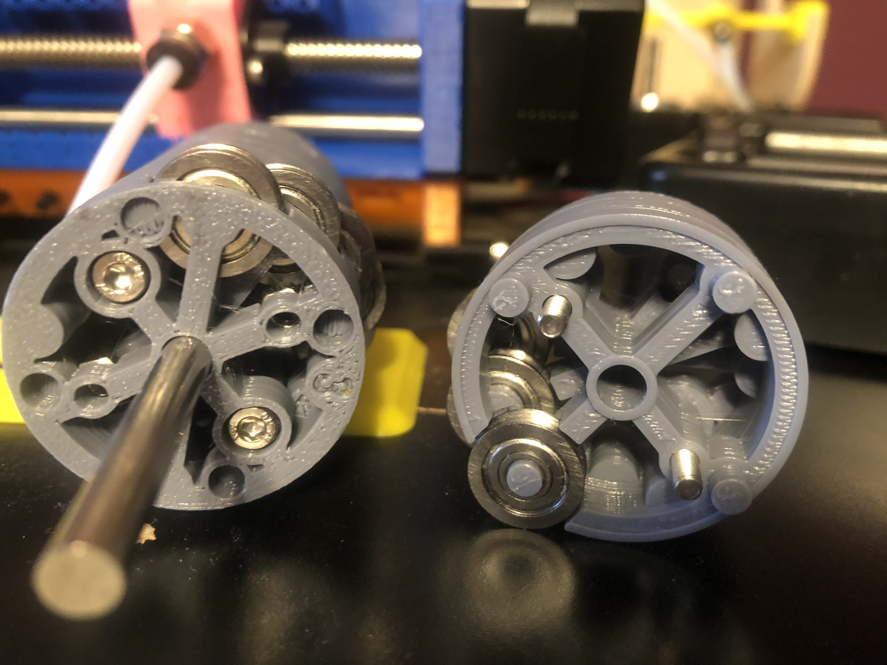
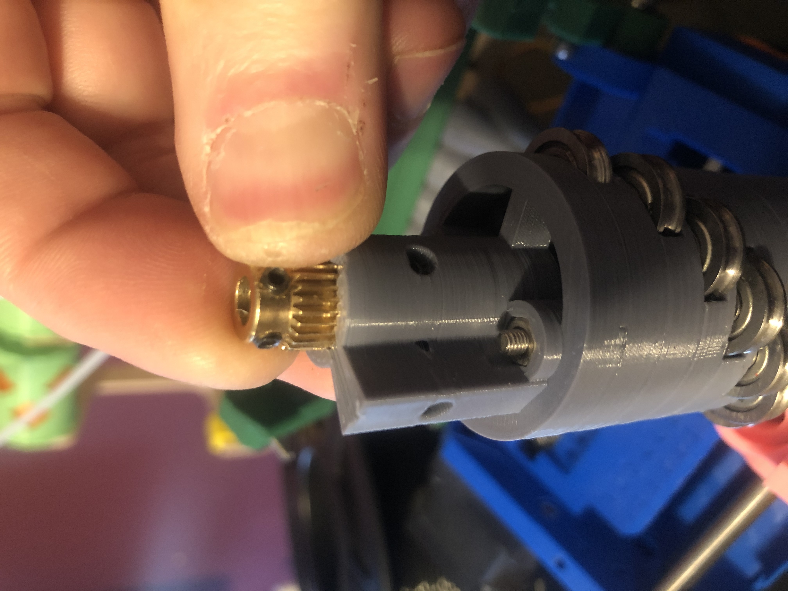
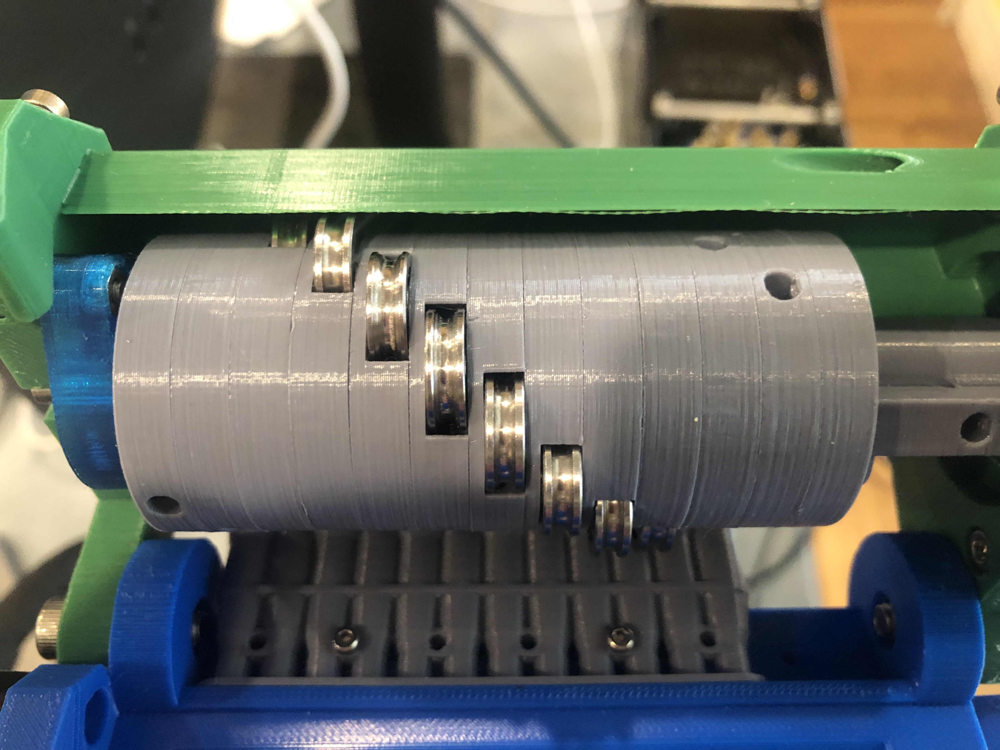
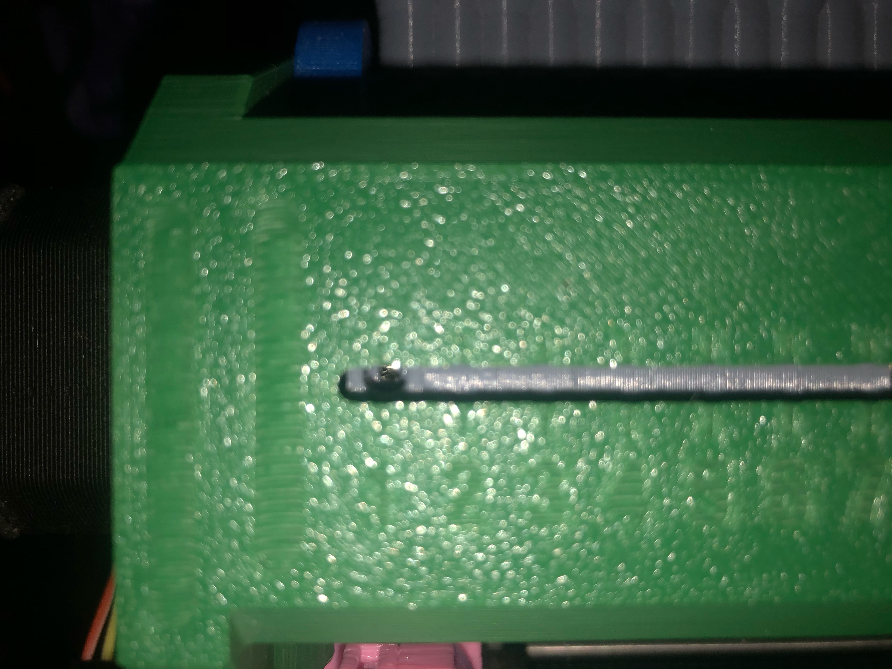
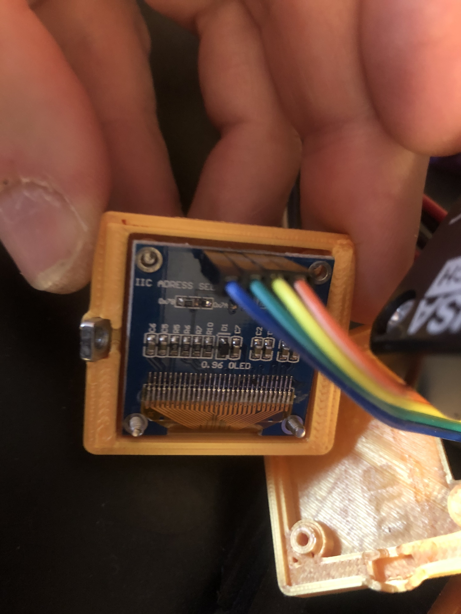
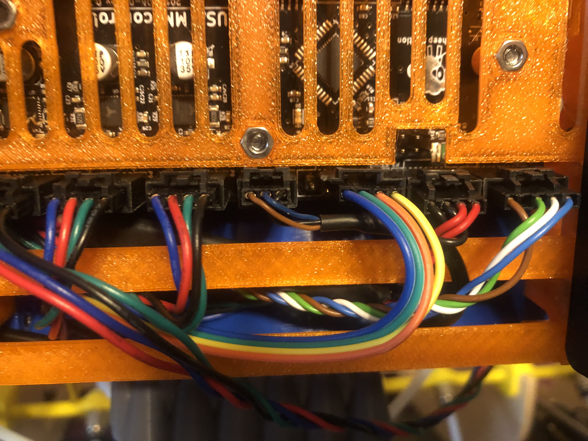

# Assembly Tips

As this project has started to gain popularity, several people have asked for more detailed
build instructions. Being a pet project, I don't have any official documentation. In general,
the files provided assume that you have previously built the stock Prusa MMU, and are probably
re-using many of the parts. Below are some of the major differences from the stock model.

### Pulley

The pulley motor is moved to the left, to make full use of its length. Install a 625Z bearing
on each side of the pulley chamber, and start feeding the motor shaft in from the left of the
unit. As you go, install the seven 40T gears. As shown here, try to align the gears so that no
filament will end up on a grub screw. The even-numbered filaments will end up in the very narrow
space between the edge of a gear and its grub screw.



### Idler

This is the most major change, as the idler has to be assembled from many pieces. Start with
the "top" (tall piece from idler-ends.stl), and add the rings in groups of three. Each ring
has a printed number (1,2,3) on the bottom, so install in order, and make sure the screw holes
line up. Place hex nuts in the end piece, and in each "#3" piece, and then after each set
install the M3 screw. These screws are probably optional, but I use them to help keep the
alignment tight.



Install the two 24T gears into the top; these secure the idler assembly to the motor spindle.
Align the grub screws with the holes, and open them to allow room for the motor spindle.
Slide the "top" end onto the motor spindle, aligning the flat side of the spindle with one pair
of grub screws. Tighten the screws on the flat side slightly to keep alignment, but do not 
tighten fully yet.



Finish the assembly with the small cap from idler-ends.stl. The cap fits into a 608RS bearing,
which in turn fits into idler-mount.stl.


At this point, install the assembly into the upper piece, using m3 screws to mount the motor
and the idler-end (hex nuts are required in the idler-end). Once the ends are secured, tighten
the grub screws, while keeping the assembly pushed as far to the right as it will go (up against
the bearing). This should provide proper alignment with the filament slots.



One last note on the idler design. The holes on each ring, opposite where the bearing fits,
was originally there to add a m2 screw on each ring. I stopped doing this when I added the 
internal m3 screws, but I did a long slot opening on the upper body. When a given filament
is "engaged," the hole on the ring should line up perfectly centered in the slot next to its
corresponding number. This helps to know if the idler has become out of expected alignment
during a print. This photo shows filament #1 "engaged."



### Display

For the optional SSD1306 display, make sure you have a model that is set to use I2C communication.
Attach four wires from the display to the unused port on the control board, which
should be labeled as "SENSOR." (In reality, this port is just an unused-but-conveniently-exposed
I2C interface.)




Note the order of the colors, here; they are not the same on both sides. 
In case you have a different display, the actual pin connections should be as shown below.
Pin "1" on the control board is the one closest to the power connection. The colors listed
below are only in reference to the wires I used in the two photos above.
```
  1 <-> VCC (yellow)
  2 <-> GND (orange)
  3 <-> SCL (green)
  4 <-> SDA (blue)
```
