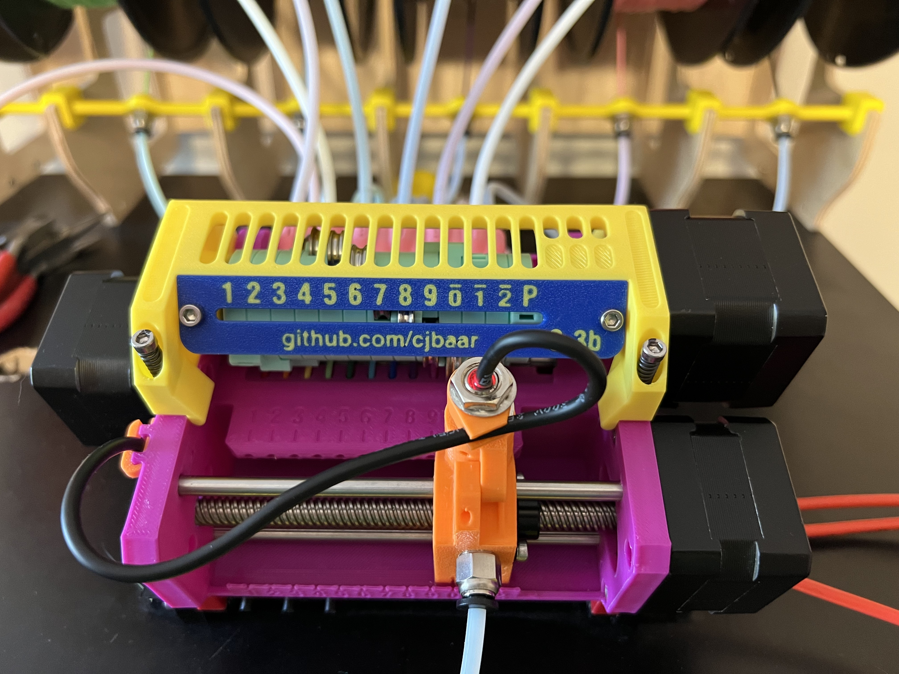

# Assembly Tips

As this project has started to gain popularity, several people have asked for more detailed
build instructions. Being a pet project, I don't have any official documentation. In general,
the files provided assume that you have previously built the stock Prusa MMU3, and are probably
re-using many of the parts. Below are some of the major differences from the stock model.

## Pulley

The pulley motor is moved to the left, to make full use of its length. Install a 625Z bearing
on each side of the pulley chamber, and start feeding the motor shaft in from the left of the
unit. As you go, install the seven 40T gears. As shown here, try to align the gears so that no
filament will end up on a grub screw. The even-numbered filaments will end up in the very narrow
space between the edge of a gear and its grub screw.

## Inlet

The inlet now uses the PTFE collets including with the MMU3 kit. It needs 12, so I used
the ones from the buffer/roller kits as well (I don't use them). If you don't have enough,
or you prefer the M10 screw PTFE locks, you can print the old inlet from the v1.4 folder.
Both models fit in the lower frame the same, and can be held with a couple of M2 screws.

## Idler

This is the most major change, as the idler has to be assembled from many pieces. Start with
the a ring labeled "3" for the bottom, and add the rings in groups of three. Each ring
has a printed number (1,2,3) on the bottom, so install in order, and make sure the screw holes
line up. Place hex nuts in the end piece, and in each "#3" piece, and then after each set
install the M3 screw. These screws are probably optional, but I use them to help keep the
alignment snug. Do not tighten the screws past the point where they are seated, or it could
compress the overall size of the idler.

Before installing the top end, make sure to inset 4x M3 hex nuts. These will hold the metal
motor mount (included with the Prusa MMU3 kit).

Finish the lower end of the assembly with the small cap from idler-ends.stl.
The cap fits into a 608RS bearing, which in turn fits into the upper frame.
Install the assembly into the upper piece, using m3 screws to mount the motor.
Tighten the grub screws, while keeping the assembly pushed as far to the left as it
will go (up against the bearing).
This should provide proper alignment with the filament slots.

Print either the single or two-color model for the faceplate (upper-panel.stl/upper-color.stl).
Install the panel with two square nuts and 6mm screws.
Once completed, the slot on each ring should align through the small window when that
filament is engaged, or when the idler is parked at the end.

## Power Board

Prusa has solved the previous MMU power issues by providing a new power board. On the
stock model, this hangs off the back of the idler. Since this model mounts the MCU
under the main body, my solution is just to bend the right-angle headers back to
straight. There is a printed cover to add-on once the board is installed.

